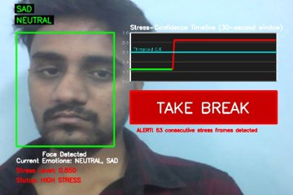

# Dynamic Minority Amplification and Fuzzy Fusion for Real-Time Stress Detection

**Multimodal Stress Detection from Facial and Vocal Cues**

> A lightweight, interpretable, real-time multimodal stress detection framework that fuses **facial expression recognition (YOLOv8n)** and **speech emotion recognition (Multi-Task CNN-BiLSTM with attention)** through **fuzzy temporal fusion**, running on a standard webcam and microphone.

---

## 🎥 Live Demo

<p align="center">
  
</p>

<p align="center"><em>
Real-time inference on a standard webcam — YOLOv8n detects the face and classifies emotions (NEUTRAL, SAD), the fuzzy fusion confidence (0.850) crosses the 0.6 threshold on the 30-second stress-confidence timeline, and after 53 consecutive stress frames the system raises a <b>"TAKE BREAK"</b> alert — Status: HIGH STRESS.
</em></p>

---

## 📌 Overview

Stress has become one of the most prevalent yet least-monitored mental health hazards. Most existing systems are unimodal (fragile to lighting, occlusion, or noise), offline, or computationally too heavy for everyday deployment.

This project bridges affective computing and deployable mental health monitoring with a system that:

- 🎥 Detects faces and classifies **7 emotions** in a single forward pass using a fine-tuned **YOLOv8n** model (AffectNet, reformatted to detection format)
- 🎙️ Classifies speech into **emotion + binary stress** using a **Multi-Task CNN-BiLSTM** with self-attention and residual connections (CREMA-D)
- 🧠 Fuses both modalities with a **fuzzy logic decision layer** over a 3-second sliding window, robust to noisy or missing inputs
- ⚖️ Handles severe class imbalance with **Dynamic Minority Amplification (DMA)** — augmentation intensity adapts whenever minority-class recall drops below τ = 0.85
- 🔔 Provides **real-time actionable feedback** — a "Take a break" alert when sustained stress is detected (4 consecutive frames with fuzzy confidence > 0.6)

**Stress mapping:** `Stress = {Angry, Sad, Disgust, Fear}` · `Non-Stress = {Happy, Neutral}`

---

## 🏗️ System Architecture

```
 Webcam ──▶ YOLOv8n ───────────────┐
            (face detection +      │
             7-emotion classify)   │      ┌──────────────────────┐      ┌──────────────────┐
                                   ├────▶ │  Fuzzy Temporal      │ ───▶ │  Stress Alert     │
 Microphone ──▶ MFCC (40) ──▶      │      │  Fusion              │      │  "Take a break"   │
                CNN-BiLSTM +       │      │  C = 0.4·s_face      │      │  (4 consecutive   │
                Attention          │      │    + 0.6·p_stress    │      │   frames > 0.6)   │
                (emotion + stress) ┘      │  3-second window     │      └──────────────────┘
                                          └──────────────────────┘
```

---

## ✨ Key Contributions

1. **Binary Stress Re-Interpretation** — AffectNet and CREMA-D emotion labels are re-coded into clinically meaningful stress / non-stress groups instead of abstract emotion tags.
2. **Dynamic Minority Amplification (DMA)** — adaptive augmentation (additive noise SNR 8–24 dB, pitch shift ±3 semitones, time-stretch 0.85×–1.15×, SpecAugment) that intensifies only when minority-class recall falls below threshold.
3. **Lightweight Dual-Branch Architecture** — YOLOv8n + CNN-BiLSTM optimized for low-latency inference on resource-limited / edge devices.
4. **Fuzzy Temporal Fusion** — interpretable rule-based fusion over a sliding window that suppresses false alarms from short-lived expressions.
5. **Real-Time Actionable Feedback** — a live interface analyzing webcam and microphone streams that notifies the user when prolonged stress is detected.

---

## 📊 Results

### Facial Emotion Model (YOLOv8n on AffectNet, 50 epochs)

| Epoch | Precision | Recall | mAP@50 | mAP@50–95 |
|------:|----------:|-------:|-------:|----------:|
| 1     | 0.113     | 0.835  | 0.122  | 0.098     |
| 20    | 0.452     | 0.679  | 0.561  | 0.560     |
| 40    | 0.609     | 0.678  | 0.673  | 0.672     |
| **50**| **0.630** | **0.725** | **0.734** | **0.734** |

### Audio Emotion + Stress Model (Multi-Task CNN-BiLSTM on CREMA-D, 45 epochs)

| Epoch | Emotion Acc | Emotion F1 | Stress Acc | Stress F1 |
|------:|------------:|-----------:|-----------:|----------:|
| 1     | 0.312       | 0.288      | 0.691      | 0.800     |
| 22    | 0.602       | 0.564      | 0.772      | 0.861     |
| **33**| **0.685**   | **0.664**  | **0.826**  | **0.890** |

- Training–validation gap of ~0.003–0.005 indicates strong regularization and generalization.
- Fuzzy multimodal fusion outperforms all unimodal baselines and ablation variants (CNN-Only, LSTM, Lightweight Transformer, Hybrid CNN-LSTM).
- Improvements validated with paired t-tests (p < 0.01) across folds.

---

## 📂 Repository Structure

```
Multimodal-Stress-Detection/
├── assets/
│   └── live_demo.png                       # Real-time demo screenshot
├── audio_model/
│   └── 02_Audio_Emotion_Model.ipynb        # Multi-Task CNN-BiLSTM speech emotion + stress (CREMA-D)
├── face_model/
│   └── 01_Facial_Expression_Model.ipynb    # YOLOv8n facial emotion recognition (AffectNet)
├── fusion_realtime/
│   └── 03_Fusion_RealTime_System.ipynb     # Fuzzy temporal fusion + real-time webcam/mic pipeline
├── .gitattributes
└── README.md
```

---

## 🗃️ Datasets

| Dataset | Modality | Details |
|---------|----------|---------|
| [AffectNet](http://mohammadmahoor.com/affectnet/) | Facial images | Reformatted to YOLOv8 detection format; 96×96 face crops; 7 emotions |
| [CREMA-D](https://github.com/CheyneyComputerScience/CREMA-D) | Audio | 7,442 clips, 91 actors, 16 kHz; truncated / zero-padded to 3 s; 40-dim MFCCs |

> ⚠️ Datasets are **not** included in this repository due to licensing. Please download them from the official sources above and update the paths in the notebooks.

---

## 🚀 Getting Started

### 1. Clone the repository

```bash
git clone https://github.com/Vamsi12022003/Multimodal-Stress-Detection.git
cd Multimodal-Stress-Detection
```

### 2. Install dependencies

```bash
pip install ultralytics opencv-python numpy librosa soundfile tensorflow torch scikit-fuzzy matplotlib seaborn
```

### 3. Run the notebooks in order

| Step | Notebook | Purpose |
|------|----------|---------|
| 1 | `face_model/01_Facial_Expression_Model.ipynb` | Train / evaluate the YOLOv8n facial emotion model |
| 2 | `audio_model/02_Audio_Emotion_Model.ipynb` | Train / evaluate the CNN-BiLSTM audio model |
| 3 | `fusion_realtime/03_Fusion_RealTime_System.ipynb` | Run fuzzy fusion + real-time stress monitoring (requires webcam + microphone) |

### Reproducibility

- 70 / 15 / 15 stratified train / validation / test split (stratified by emotion)
- Fixed random seeds (NumPy, PyTorch, TensorFlow) and pinned CUDA settings
- All logs, confusion matrices, and metrics saved for independent verification

---

## 🔬 Method Highlights

- **Preprocessing:** zero-mean unit-variance audio normalization → 40-dim MFCCs (per-sample standardized); 48×48 grayscale faces resized to 96×96 RGB; 3 s sliding temporal windows.
- **Loss functions:** weighted cross-entropy + BCE (multi-task heads); dynamic focal loss (γ = 2.0) for stress-sensitive baselines.
- **Optimization:** Adam (lr = 3e-4 for the multi-task model), adaptive dropout 0.4–0.5, batch size 44, 80 epochs.
- **Fuzzy fusion:** `C_fuzzy = 0.4·s_face + 0.6·p_stress`; alert fires only after 4 consecutive frames exceed 0.6 — sustained stress, not momentary expressions.

---

## 📖 Citation

If you use this work, please cite:

```bibtex
@article{pallapu2026stressdetection,
  title   = {Dynamic Minority Amplification and Fuzzy Fusion for Real-Time
             Stress Detection from Facial and Vocal Cues},
  author  = {Pallapu, Krishna Vamsi and Santhi Sri, T.},
  year    = {2026},
  institution = {Koneru Lakshmaiah Education Foundation (KLEF), Vaddeswaram, India}
}
```

---

## 👤 Authors

**Krishna Vamsi Pallapu**
Department of CSE, Koneru Lakshmaiah Education Foundation (KLEF), Vaddeswaram, AP, India
ORCID: [0009-0007-3597-391X](https://orcid.org/0009-0007-3597-391X) · GitHub: [@Vamsi12022003](https://github.com/Vamsi12022003) · ✉️ krishnavamsi12022003@gmail.com

**Dr. T. Santhi Sri** (Supervisor)
ORCID: [0000-0003-4763-0088](https://orcid.org/0000-0003-4763-0088)

---

## 📄 License

This project is released under the MIT License.

## 🙏 Acknowledgements

- [Ultralytics YOLOv8](https://github.com/ultralytics/ultralytics) for the detection framework
- AffectNet and CREMA-D dataset creators
- KLEF Department of Computer Science and Engineering
